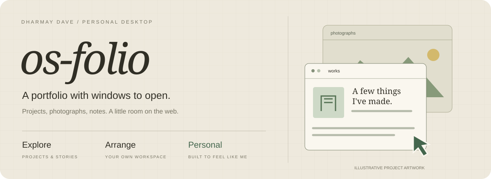
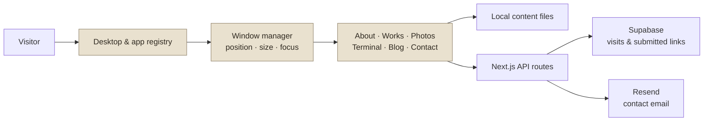

<p align="center"></p>
<p align="center"><a href="https://os-folio.vercel.app/">Explore the desktop</a> · <a href="docs/SETUP.md">Setup & customization</a> · <a href="docs/ARCHITECTURE.md">How it works</a></p>

# A portfolio that feels like a personal computer

**os-folio is Dharmay Dave's portfolio, built as a windowed desktop.** Open projects like applications, browse photographs like folders, read notes in a text editor, or explore through a terminal. The interface is part of the work.

Built with **Next.js 16, React 19, TypeScript, and Tailwind CSS 4**.

## Take a look around

| Open | Find |
| :--- | :--- |
| **About & Experience** | Background, work history, and a downloadable CV. |
| **Works** | Project cards and detailed project windows with source and demo links. |
| **Photos & text files** | Travel folders, images, and personal notes. |
| **Terminal & Search** | Alternative ways to navigate the portfolio. |
| **Blog & Contact** | Reading links, visitor submissions, and an email contact form. |
| **Settings** | Light/dark appearance, accent colors, wallpapers, and brightness. |

Windows can be dragged, resized, minimized, and brought forward from the taskbar. Browser storage remembers appearance preferences.

## The desktop underneath



The content is separate from the window system. Most changes to projects, experience, photos, or personal notes belong in [`content/`](content/), so editing a portfolio entry does not require rebuilding an app window.

## Run locally

Use Node.js **20.9 or newer** and npm.

```sh
git clone https://github.com/DocMorphic/os-folio.git
cd os-folio
npm ci
npm run dev
```

Open [localhost:3000](http://localhost:3000). The core desktop works without service credentials. Contact delivery requires Resend; persistent statistics and submitted blog links require Supabase. See [setup and optional services](docs/SETUP.md).

## Make it yours

| Change | File or folder |
| :--- | :--- |
| Biography and social links | [`content/about.ts`](content/about.ts) |
| Project cards and detail pages | [`content/projects.ts`](content/projects.ts), [`content/project-details.ts`](content/project-details.ts) |
| Experience | [`content/experience.ts`](content/experience.ts) |
| Reading links, text files, photo folders | [`content/`](content/) |
| App sizes and registration | [`lib/constants.ts`](lib/constants.ts) |
| Desktop icons and menu | [`components/desktop/`](components/desktop/) |
| Window behavior | [`hooks/use-window-manager.ts`](hooks/use-window-manager.ts) |

The repository includes personal writing, photographs, and a CV; replace those with your own material when adapting the design.

## Development & deployment

```sh
npm run lint
npm run build
npm start
```

Deploy the Next.js project to Vercel and configure only the optional services you use. [Deployment notes →](docs/SETUP.md#deploy)

[`docs/ARCHITECTURE.md`](docs/ARCHITECTURE.md) maps the UI, content, and service layers. [`CONTENT_MAP.md`](CONTENT_MAP.md) is the editing guide.

## Project notes

Site Stats counts stored visitor identifiers and daily visits; it is not a count of distinct people. The terminal is a portfolio interaction, not a server shell.

No repository-wide license is currently declared. Public source availability does not grant permission to reuse personal media or third-party assets.

<p align="center"><sub>Open a window. Get to know the person behind it.</sub></p>
