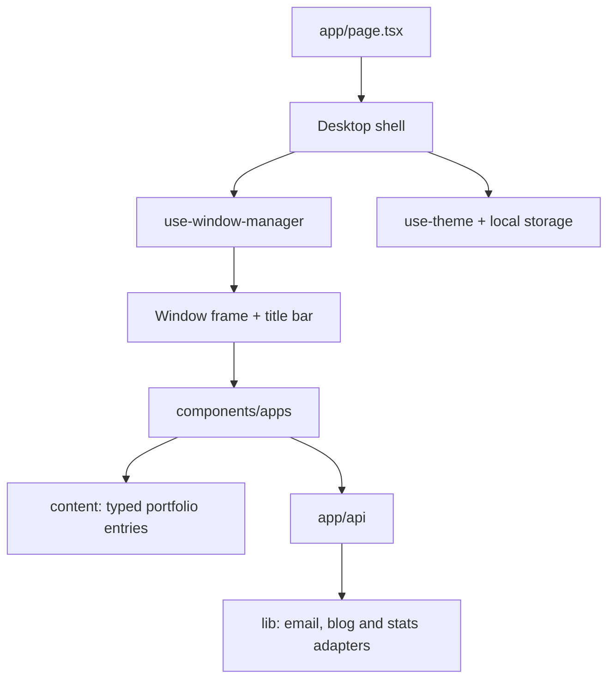

# Inside the desktop

[← Overview](../README.md) · [Setup](SETUP.md)

| Layer | Responsibility |
| :--- | :--- |
| [`components/desktop/`](../components/desktop/) | Boot screen, wallpaper, icons, menus, and taskbar. |
| [`components/window/`](../components/window/) | Shared draggable and resizable window presentation. |
| [`hooks/use-window-manager.ts`](../hooks/use-window-manager.ts) | App instances, focus order, geometry, and window state. |
| [`components/apps/`](../components/apps/) | Individual portfolio applications. |
| [`content/`](../content/) | Author-owned content, separate from desktop mechanics. |
| [`app/api/`](../app/api/) | Contact, visit tracking, submitted blog links, and link-title fetching. |
| [`lib/`](../lib/) | Service adapters, types, constants, and wallpaper definitions. |

Appearance preferences live in browser storage. Shared visit and blog records use Supabase when configured. Email goes through the server-side Resend adapter.

The diagrams describe the committed desktop application. They do not include unfinished work in a local checkout. The README cover is original SVG artwork illustrating its window system, not a screenshot.
